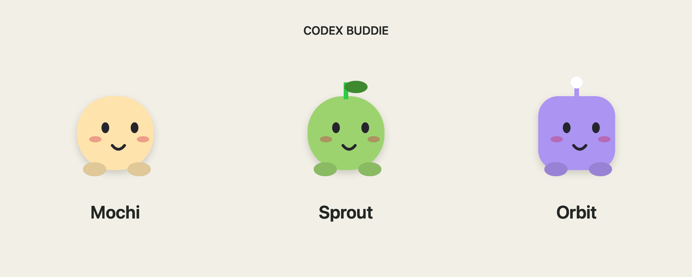

# Codex Buddie

A tiny character that follows the computer-use cursor on your Mac.

**Product target:** fully replace the visible agent pointer with an animated character that walks along its curved movement path and animates at the click point. No gray arrow should remain visible. The current follower is a feasibility prototype; see [the next implementation brief](docs/next-steps.md).

**Research prototype, macOS only.** The current app follows native OpenAI computer-use cursor windows using macOS window metadata. It includes three original characters, a custom PNG sprite loader, a mouse-following demo, and an experimental mode that draws the character over the cursor's approximate location.



The prototype does **not** remove OpenAI's original cursor or replace the cursor inside background picture-in-picture or browser previews. Native cursor tracking was observed locally during real CUA actions. Compatibility across app versions and clean machines still needs validation.

Read the [implementation research](docs/research.md) for the evidence, available integration paths, and next steps. [Validation details](docs/validation.md) separate what was tested from what remains unverified.

## Build and run

Requires macOS 14+, Xcode Command Line Tools, and Git. Tested on Apple Silicon with macOS 26.5 and Swift 6.3.3. The build targets your Mac's architecture. macOS 14 and Intel have not been tested.

```sh
git clone https://github.com/Suture-AI/Codex-Buddie.git
cd Codex-Buddie
bash scripts/build.sh
open 'build/Codex Buddie.app'
```

Select **◉ Buddie** in the menu bar:

- **Mochi / Sprout / Orbit:** choose a character.
- **Follow agent cursor:** follow the most recently moving native computer-use cursor.
- **Demo: follow my mouse:** preview the character using your physical pointer.
- **Cover gray cursor (experimental):** center the character over the cursor window instead of beside it. Coverage is approximate and may lag.
- **Load sprite pack…:** choose a `pack.json`; see [sprite packs](docs/sprite-packs.md).
- **Preview characters:** open the character picker and a harmless click-test button.
- **Pause / Quit:** hide or stop the companion immediately.

Agent mode may require Screen Recording permission to read cursor-window titles. The menu includes a permission action. Restart the app after granting access if tracking remains unavailable. The app reads window metadata; it does not record screen pixels, keyboard input, or conversations, and makes no network requests. It does not request Accessibility access or execute computer-use actions itself.

For a source installation into `~/Applications`, run `bash scripts/install.sh`. That script builds and opens the app and refuses to overwrite an existing installation. Quit the app and remove its `.app` bundle to uninstall. There is no background service or login item.

The local build uses an ad-hoc signature. A downloadable release for ordinary users still needs Developer ID signing, notarization, and clean-machine testing. Do not disable Gatekeeper to distribute it.

## Development

```sh
bash scripts/test.sh

# Real native-cursor tracking, preview window, and metadata trace:
'build/Codex Buddie.app/Contents/MacOS/CodexBuddie' --preview --trace

# Physical-mouse demo; automatically stop after 30 seconds:
'build/Codex Buddie.app/Contents/MacOS/CodexBuddie' --demo --quit-after 30

# Fingerprint installed OpenAI implementation without changing it:
python3 tools/inspect-runtime.py

# Observe Computer Use / ChatGPT window metadata for 15 seconds:
xcrun swiftc tools/inspect-windows.swift -o /tmp/buddie-inspect-windows
/tmp/buddie-inspect-windows 15
```

The `--trace` option prints cursor coordinates and window identifiers locally. The window-inspection tool is broader: it can print ChatGPT window titles. Review its output before sharing it. Neither diagnostic is required to run the companion. The optional Python inspection tool requires Python 3.11 or newer.

No npm packages, model subscription, or API key are required for the character app. To follow an agent, you separately need an installed, working computer-use runtime.

## Project layout

| Path | Purpose |
| --- | --- |
| `Sources/BuddieCore.swift` | Cursor selection, coordinate conversion, sprite validation and decoding |
| `Sources/BuddieView.swift` | Original character renderer |
| `Sources/main.swift` | Menu bar, native overlay, cursor-window adapter and preview |
| `Tests/CoreTests.swift` | Behavioral checks for tracking and sprite loading |
| `tools/inspect-runtime.py` | Read-only, version-specific implementation fingerprint |
| `docs/` | Research, evidence, sprite format and validation |

This is an independent Suture AI project. It is not affiliated with or endorsed by OpenAI. OpenAI app code and assets are not included. Publication and licensing are still to be finalized; no release has been published from this initial investigation.
