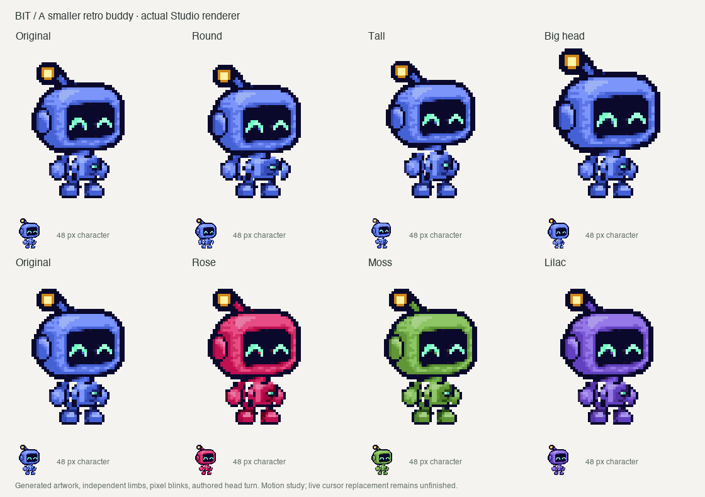

# Bit — original retro-bot study

The user supplied a compact blue Codex pet as the visual reference and asked
for a smaller retro 8-bit bot with much better animation. Bit follows that
direction with a blue screen-faced robot, simple mint eyes, short limbs and an
amber antenna. The user approved this visual direction and asked for a shorter
neck, closer to the original generated concept.



## Generated sources

All five images were generated sequentially through ChatGPT in Brave in
[this art conversation](https://chatgpt.com/c/6abdd0db-1804-83e8-8ac9-505a7e27ca9b).
The prompt requested GPT Image 2.5 if available; the UI did not expose the image
model identifier. No exact model version is certified.

- [Concept source](concept-source.png), image 1: original complete Bit.
- [First walking attempt](walk-attempt-1.png), image 2: rejected because the
  bottom row reverses direction instead of completing the rightward gait.
- [Second walking attempt](walk-attempt-2.png), image 3: rejected because the
  second half still repeats the leading-foot relationship.
- [Head turn source](turn-source.png), image 4: five right/front/left heads.
- [Torso turn source](body-turn-source.png), image 5: five chest directions.
  The builder removes the bottom hip peg, registers an 11 px torso at its
  existing attachment, and quantizes it into the shared palette.

The user's reference image was not added to the repository. Browser upload
was blocked by extension file access, so its visual direction was described
in the prompt. The generated robot is an original design.

## Processing and motion

`scripts/build-bit.py` resamples the concept to a logical 64 px canvas with
nearest sampling and binary alpha. The [canonical image](canonical-64.png)
uses a reviewed 16-color palette that reserves mint and amber accents. The
head, torso, paws, legs and boots are isolated from this art. Their source
rectangles are recorded in [the pack provenance](../../Characters/bit/provenance.json).
A transparent tail fills the current biped schema's unused tail slot.

The walking sheets are not used. Independent limbs follow the native motion
core; attachment coordinates snap to logical pixels. Fast travel uses its
bounded airborne gait. Paws move in opposing one-pixel steps. The renderer
preserves the input hotspot rather than moving the cursor to accommodate art.

The calf cutouts exclude boot highlights and pixels from the inter-leg gap;
boot cutouts retain their full outer outlines. Pixel legs now sample those
original calf textures in connected rows on the logical pixel grid, instead
of rotating and stretching a sparse bitmap. See the
[leg comparison](../../docs/media/bit-leg-comparison.png), against `e0f00e2`.
The [close-up gait](../../docs/media/bit-gait-detail.gif) includes a transition
from fast flight to continued slow travel. Airborne landings follow the hips,
descend without an extra hop, land the lower foot first, then hold world-space
contact. A small compression follows touchdown.

Turn heads share one scale and collar registration. The generated head strip
introduced a 4–5 pixel neck; the builder retains one collar row and registers
it at the head pivot. This keeps the chin close to the torso at every head size
and aligns the collar through all five orientations. See the
[before/after Cocoa comparison](../../docs/media/bit-neck-comparison.png).
Each orientation keeps its
authored perspective; it is not flipped again. Reversing partway retraces the
turn progress. Right and left blink variants alter only localized screen-eye
pixels, with identical alpha and unchanged surrounding head art.

The torso now follows the head through five authored directions, while limbs
keep their physical screen-side positions. See the [turn review](../../docs/media/bit-studio-turn.png).
This remains a motion study: lighting/antenna perspective is imperfect, richer
expressions, knee articulation and additional body types remain unfinished.
The Studio's size/proportion controls were exercised through official CUA
before this leg update. Native observation currently returns
`cgWindowNotFound`; this pass uses the actual Cocoa renderer's offline exports
and tests. Live cursor replacement remains unverified.

## Reproduce

From the repository root, with Pillow, ffmpeg and Xcode Command Line Tools:

```sh
uv run --with pillow python scripts/build-bit.py
bash scripts/test-animation.sh
bash scripts/build.sh
".build/Codex Buddie Lab.app/Contents/MacOS/BuddieLab" --self-test
".build/Codex Buddie Lab.app/Contents/MacOS/BuddieLab" --export-puppet .build/bit-review bit
".build/Codex Buddie Lab.app/Contents/MacOS/BuddieLab" --export-frames .build/bit-cocoa bit
".build/Codex Buddie Lab.app/Contents/MacOS/BuddieLab" --export-turn .build/bit-turn
".build/Codex Buddie Lab.app/Contents/MacOS/BuddieLab" --export-gait .build/bit-gait
uv run --with pillow python scripts/review-bit.py .build/bit-review .build/bit-cocoa --turn .build/bit-turn --gait .build/bit-gait
```

The PNG frame directories are regenerable intermediates. The retained
[walking GIF](../../docs/media/bit-studio-walk.gif),
[fast-travel GIF](../../docs/media/bit-studio-fast-travel.gif),
customization sheet and [review measurements](../../docs/evidence/bit-studio.json)
are the published outputs. The earlier Pip evidence pins revision
`ad4b018`; it is historical evidence rather than a checksum of today's source.
The neck comparison/record similarly describes revision `1baeb50`, before
the coordinated torso-turn update.
