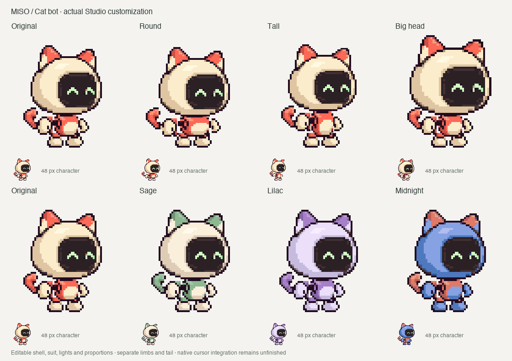

# Miso — animated pixel cat bot



Miso is selectable in the Studio collection, with independent boots, hands,
calves and a curled tail; five coordinated head/torso/tail directions; blinks and
click/travel expressions; three editable material colors; and torso/head
proportions. The source remains cream/coral, with Sage, Lilac and Midnight
examples demonstrating independent recoloring. These are review examples,
not named palette buttons in the app. User design approval is not claimed.

## Generated source art

Six images were generated sequentially in ChatGPT using Brave and official
CUA, as requested. The UI did not expose the image model identifier, so the
requested GPT Image 2.5 version is unverified.

- [Concept](concept-source.png): unmodified 1254×1254 RGBA download with real
  transparency. [Original prompt](prompt.md).
- [First head strip](turn-attempt-1.png): rejected because left-facing heads
  mirrored the bright shell highlight.
- [Corrected head strip](turn-source.png): five perspectives with the highlight
  on the image's upper left, including a distinct front view.
- [Torso strip](body-turn-source.png): five coral chest shells with a cream belly.
- [First tail strip](tail-turn-attempt-1.png): rejected for mirrored highlights.
- [Corrected tail strip](tail-turn-source.png): five isolated curls with continuous
  attachment stems and fixed image-left lighting. [Exact tail prompts](tail-prompts.md).

The exact [follow-up prompts](turn-prompts.md), [art provenance](provenance.json)
and [pack processing record](../../Characters/miso/provenance.json) are retained.
`concept-preview.png` is a reduced concept preview on cream.

## Processing and animation

[build-miso.py](../../scripts/build-miso.py) registers the heads to one shared
38-pixel scale and chin baseline, with no neck stalk. Torso parts use a common
13-pixel height. A reviewed 16-color palette keeps square pixel clusters
consistent. Arms, calves and boots come from the original concept. Tail views
use a common 14-pixel height, with the bottom stem center registered at `[34,53]`.
The anchor moves around the hips as the torso turns; the front view is fully
hidden behind the head/body. Both endpoint tails flex one pixel each way,
tapering to zero at the root. Every tail texture remains four-connected.

Expression variants are local pixel edits of the generated heads. Tests
verify that all 25 source variants preserve alpha and every non-eye pixel.
The 68-frame pack has separate masks for cream shell, coral suit and screen
lights. Save/import retains every recolored frame, attachment and proportion.

Review the actual Cocoa [walk](../../docs/media/miso-walk.gif),
[gait and landing](../../docs/media/miso-gait.gif),
[tail turn](../../docs/media/miso-tail-turn.gif),
[faces](../../docs/media/miso-faces.gif) and
[evidence](../../docs/evidence/miso-studio.json).

The current [tail review](../../docs/tail-review.md) and
[evidence](../../docs/evidence/miso-tail.json) supplement the earlier review;
the original live screenshot predates this tail change. This is still a
character study. Arms retain screen-side artwork during turns, and broader
anatomy remains unfinished. Library persistence passes automated checks;
live restart verification and native Codex cursor replacement remain open.

## Reproduce

```sh
uv run --with pillow python scripts/build-miso.py
bash scripts/test-animation.sh
bash scripts/build.sh
".build/Codex Buddie Lab.app/Contents/MacOS/BuddieLab" --self-test
".build/Codex Buddie Lab.app/Contents/MacOS/BuddieLab" --export-turn .build/miso-tail-turn miso
".build/Codex Buddie Lab.app/Contents/MacOS/BuddieLab" --export-gait .build/miso-tail-gait miso
uv run --with pillow python scripts/review-tail.py .build/miso-tail-turn .build/miso-tail-gait
```

Raw PNG frame directories are regenerable intermediates. The published GIFs,
contact sheets and evidence JSON are the retained review outputs.
