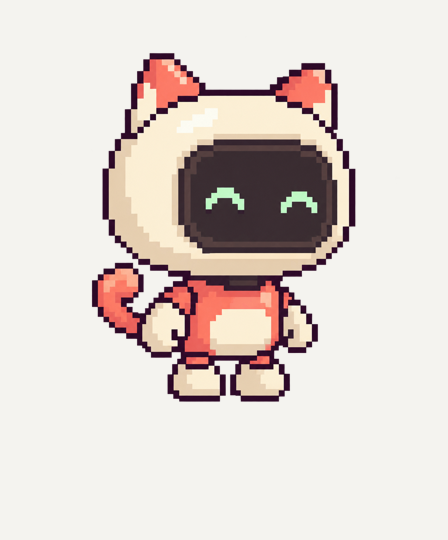

# Miso — cat bot concept

Original artwork generated one image at a time in ChatGPT using Brave and the
official CUA runtime, as requested. [Full prompt](prompt.md) and
[provenance](provenance.json) are retained. The UI did not expose the image
model identifier, so the requested GPT Image 2.5 version is unverified.

`concept-source.png` is the unmodified 1254×1254 RGBA download with real
transparency. `concept-preview.png` places a reduced preview on a cream canvas.

The cream/coral palette, cat ears, short collar and curled tail make Miso a
distinct candidate for the collection. It is not yet a runtime buddy or a
user-approved design. Next: register the source at a common pixel scale, cut
and validate separate limbs, author turn perspectives and face states, then
review actual walking and customization before adding it to the picker.
