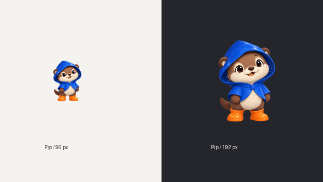

# Pip blink study



This is a generated facial animation study, not an installed buddy or a native
cursor integration. The user has not approved the Pip art direction yet.

`source.png` was generated in the same ChatGPT conversation with the original
Pip image explicitly attached as an edit reference. The request specified six
full poses, a fixed camera and scale, neutral paws/feet, and eyelids changing
from open through closed and back. The rest of the character remained grounded
in the canonical image.

Extraction locates actual alpha components, groups detached details, and uses
one scale and canvas for all six poses. It does not slice assumed equal cells or
resize each body independently. `frames/geometry.json` records detection and
registration; `review.json` records actual file checks and visual observations.

The idle blink holds the open eyes, closes over several short frames and reopens.
The GIF uses 2400/50/50/80/60/800 ms frame durations. Review this together with the
contact sheet. Source bounds vary by 0.4% in height and 1.14% in width, so runtime
review still needs to check for visible drift at the intended character size.

To reproduce extraction (Pillow required):

```sh
uv run --with pillow python scripts/extract-poses.py \
  artwork/pip/blink-study/source.png artwork/pip/blink-study/frames \
  --columns 3 --rows 2
```

Do not use this idle registration unmodified for airborne walk/run or jump poses:
those require a shared source baseline that preserves intentional vertical lift.
