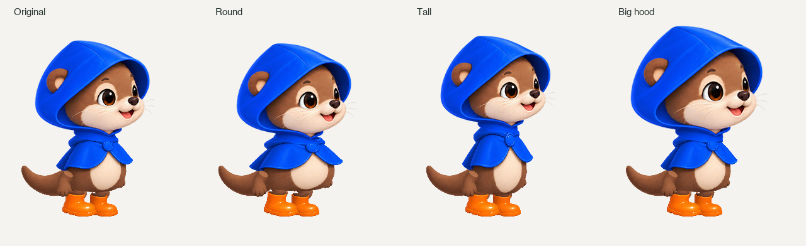

# Articulated Pip study

The original offline proof below is retained as historical evidence. Its input
trace and source hashes in `review.json` belong to that revision. The rig is now
a selectable version-3 Studio pack with real Cocoa rendering, live proportions,
editable colors and save/import; see the [current pack documentation](../../../docs/characters.md#version-3-articulated-character-parts) and
[Cocoa review](../../../docs/evidence/articulated-studio.json). The user has since
steered the visual direction toward a smaller retro pixel bot; Pip remains an
animation/customization study.

The complete-pose walk study repeats the leading-foot relationship in several
poses. Extra frames cannot correct that underlying anatomy. This experiment
uses original, separately generated cutout artwork with the native motion core
to test continuous feet and independent body proportions before committing to
a new production pack format.



## Generated artwork

ChatGPT in Brave generated one parts sheet, then one matching head-blink sheet
in the existing Pip conversation. `provenance.json` and `blink/provenance.json`
record source names, hashes and image numbers. The prompts requested GPT Image
2.5 if available; the UI did not expose the actual image-model identifier.
[`chatgpt-blink.jpg`](chatgpt-blink.jpg) records the completed head generation.

The source provides a head, torso, tail, paw and two legs/boots. Reviewed
rectangles in `parts.json` crop those pieces. Each leg is split into an upper
leg and a boot so the sole can keep its orientation and contact while the hip
moves. Orange cuff pixels are removed from the overlapping upper-leg layers.
The two boot pivots are calibrated to their actual opaque sole pixels, rather
than their differently padded canvases.

Three blink textures share the canonical head. Feathered eye patches from
the half/closed images change the eyelids while retaining the exact base alpha
and every pixel outside those patches. The fourth generated head has whiskers
near the source's right boundary and is not used. No body/camera swap occurs
during the blink.

## Motion and customization

[`pip-articulated-study.gif`](../../../docs/media/pip-articulated-study.gif)
shows walking, stopping, reversal and blinking. The trace comes from the actual
`BuddieMotion.c` core at 60 Hz; Pillow composites generated textures and the GIF
samples that trace at 30 Hz. This is an offline study, not the Cocoa renderer
or a live CUA recording.

The core now commits each airborne landing in world space. After stopping,
one foot lifts into rest while the other remains planted. A resumed movement
finishes an ongoing landing, and the next swing gets a full travel interval.
The cursor coordinate and gait phase are not advanced by settling. Slow-travel
detection uses velocity, so it does not disappear at higher refresh rates.

The renderer independently changes torso width, torso height and head size;
attachment positions follow the changed proportions. These settings are shown
in the comparison above. The initial offline revision did not expose these controls in Studio. They
are now available in **Pip · Articulated**, alongside size, gait and outfit colors.

## Reproduce

With Xcode Command Line Tools and Pillow available, from the repository root:

```sh
uv run --with pillow python scripts/prepare-puppet-art.py
mkdir -p .build
xcrun clang -std=c11 -Wall -Wextra Sources/BuddieMotion.c scripts/export-puppet-motion.c -lm -o .build/export-puppet-motion
.build/export-puppet-motion > .build/puppet-motion.json
uv run --with pillow python scripts/puppet-study.py .build/puppet-motion.json .build/puppet-study
bash scripts/test-animation.sh
```

Review the [contact sheet](../../../docs/media/pip-articulated-contact.png) as
well as the loop. The initial prototype preceded the version-3 schema. Use the current Cocoa
exports to assess the integration; these older images remain trace evidence.

## Remaining quality gates

- Cocoa/pack integration is implemented; manual control testing remains
  pending while native UI observation is unavailable. Version-2 packs still pass.
- Author actual turning art. The study still mirrors the character instantly
  and reverses the light; a physically stable foot coordinate does not make that
  turn visually seamless.
- Improve shoulder overlap, leg deformation and the movement of clothing.
  Scaling a painted leg is a prototype, not a finished skeletal animation system.
- Test curved/diagonal motion, high-speed running and interruptions visually.
  Current contact checks cover controlled straight travel, stops and reversals.
- Add interaction poses driven by real input events. The supported native CUA
  integration and production cursor sizing remain unresolved.

The user has not approved this as a final character. These assets and the motion
fixes are concrete progress toward the full goal, not completion of it.
