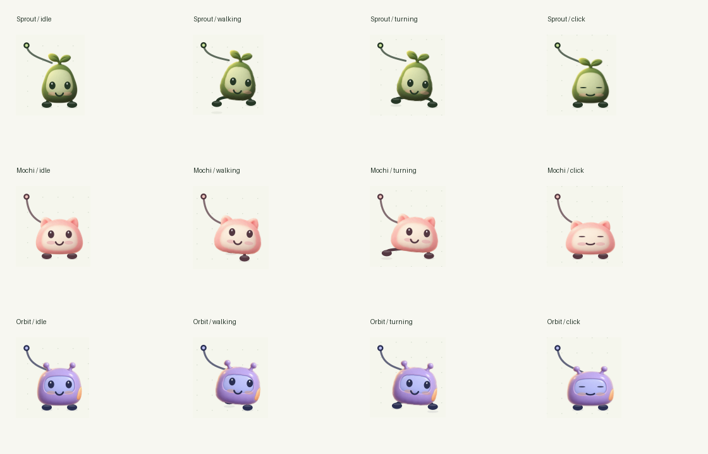

# Character animation validation — 2026-09-30

Tested on Apple Silicon macOS with the local Xcode toolchain.

- Pure C motion checks passed: identical gait phase over equal paths at 30, 60
  and 120 Hz; world-planted contact; click anchor unchanged; reduced motion;
  teleport reset; exact curved arrival; continuous velocity when retargeting.
- Character checks passed for all three generated PNG packs, independent preset
  copies, export/import of tuned geometry and artwork, refusal to overwrite an
  existing pack, procedural fallback, schema/ranges, missing files, remote paths,
  traversal, symlink escape and invalid colors.
- Native renderer harness passed: software/fog replacement, retained dimensions,
  detached original artwork, repeated assignments, unrelated windows untouched,
  and fallback for unknown renderers.
- Seven existing Mach-O tests passed. No native service was patched or launched
  as part of this animation update.
- The generated PNGs have transparent and opaque pixels. Barely visible alpha
  noise was removed, images cropped, and antialiased assets downsampled to 512 px.



The [motion recording](media/buddies-walking.gif) comes from 720 deterministic
frames rendered by the same `BuddieView` used in the studio, at 60 samples/sec,
encoded to 30 fps for viewing. It includes an interrupted trajectory and explicit
press/release per character. It demonstrates the controlled renderer, not native
Codex replacement, actual screen refresh performance, or a live CUA task.

Reproduce the recording after building:

```sh
".build/Codex Buddie Lab.app/Contents/MacOS/BuddieLab" --export-frames .build/motion-frames
ffmpeg -framerate 60 -i .build/motion-frames/frame-%04d.png \
  -vf 'fps=30,scale=630:-1:flags=lanczos,split[s0][s1];[s0]palettegen=max_colors=128[p];[s1][p]paletteuse=dither=sierra2_4a' \
  -loop 0 docs/media/buddies-walking.gif
```

Remaining product gates: supported live renderer integration, verified native
movement/press/drag/visibility signals, browser and picture-in-picture surfaces,
multi-display accuracy, lifecycle/performance profiling, durable collection
management, and signed distribution. The native IPC signing blocker still
applies. No claim of seamless replacement in stock Codex is made by this update.
# Complete-pose Pip follow-up — initial four-pose checkpoint

The studio now loads version 2 packs with shared canvases/hotspots, per-frame
timings, distance-driven gait selection, optional leftward mirroring and explicit
press/release clips. Pip supplies six idle/blink frames and four walk key poses.

Passed locally: pack validation, timing boundaries, complete-frame save/import,
shared dimensions, invalid durations/types/paths, build, and native harness
checks comparing actual rendered blink frames and stable Reduced Motion output.
The sprite hotspot remains fixed through press. Existing motion and Mach-O
checks also passed. Official CUA inspection verified Pip in the studio, the
revised size/stride controls and active walking. No live replacement is implied.

The [recording](media/pip-motion-study.gif) comes from 240 AppKit-rendered frames
at 60 Hz, sampled to 30 fps for the GIF; [contact sheet](media/pip-render-contact.png).
Recreate raw frames with:

```sh
".build/Codex Buddie Lab.app/Contents/MacOS/BuddieLab" --export-frames /tmp/pip-frames pip
```

Ten PNGs have shared 256×320 canvases, transparent margins, no edge clipping and
opaque coverage at the declared `(128,48)` hotspot. Hashes and remaining visual
gaps are recorded in [the review](../artwork/pip/walk-study/review.json). The
four-pose gait still needs in-betweens, clearer leg separation and an authored
idle/turn transition. Mirrored lighting and small native software-cursor bounds
also remain limitations. These facts prevent claiming finished animation quality.

## Eight-pose / directional-idle refinement

Current Pip has eight walk poses and six new idle/blink poses matching the side
view. The runtime holds that facing direction at rest and in Reduced Motion.
Native rendering tests compare right-facing idle, a completed leftward journey,
the stopped pose, and the still pose under Reduced Motion. They also prove that
front-facing packs retain their authored orientation when `directionalIdle` is
false. Save/import tests cover both facing flags.

The replacement factory now loads the bundled Pip pack before studio overrides.
The preparer includes character assets in the isolated native bundle. Two new
preparation tests verify that signing and artwork writes target only the copy,
the source remains unchanged, existing destinations are refused, and development
signatures keep hardened runtime enabled. All nine Python tests, motion/pack
checks, build and native harness passed locally.

See [the refined recording](media/pip-refined-motion.gif),
[rendered poses](media/pip-refined-contact.png),
[ChatGPT generation screenshot](media/pip-chatgpt-refinement.jpg), and
[asset checks](../artwork/pip/walk-refinement/review.json). Native desktop windows
were unavailable through CUA this turn; visual runtime evidence is the actual
AppKit export harness. Brave's browser connection verified the generated sheets.
Leg contact, turn/settle transitions and lighting consistency remain unapproved.
The separate [development-signing probe](development-signing.md) did not establish
a live native connection.
# Outfit customization follow-up

The complete-pose renderer now supports up to three masked color materials.
Pip exposes raincoat and boots independently. Reviewed Cobalt, Rose, Moss and
Lilac against all 14 poses, including lifted boots, face blinks and 64 px light
and dark background composites. Boot-mask refinement removed fur spill and
unrecolored highlight rims found in the first visual review.

- `bash scripts/test-animation.sh`: motion and pack checks pass. Added checks
  for untouched default art, cached recoloring, alpha preservation, protection
  outside the selected material, independent character copies, exact colored
  save/import round-trip, reset, invalid material definitions and unsafe masks.
- Appearance preparation measured about 67–75 ms for all 14 poses on this Mac
  after removing per-pixel color-object conversion. This is a local measurement,
  not a hardware-independent performance guarantee. Animation uses cached frames.
- Warning-free app build; Cocoa replacement/rendering self-test passes.
- Native CUA app observation still returns `cgWindowNotFound`. The new color-well
  interactions have not been exercised through live desktop automation. Visual
  evidence is from the same color-rendering API used by `BuddieView`, exported
  through the built Cocoa app. It does not certify native CUA replacement.

Reproduce the visual review (Pillow required for the contact/GIF composition):

```bash
bash scripts/build.sh
'.build/Codex Buddie Lab.app/Contents/MacOS/BuddieLab' --export-palettes .build/palette-study
uv run --with pillow python scripts/palette-review.py .build/palette-study docs/media
```

Kept artifacts: [color study](media/pip-outfit-colors.png) and
[walk palette check](media/pip-outfit-walk.gif), plus the
[all-pose contact sheet](media/pip-outfit-contact.png). Temporary exported poses are
reproducible and are not required inputs for the app.

This improves appearance customization only. Leg ownership, authored turns and
settles, native input events, production cursor sizing, and live service
integration remain open. Body/face geometry is still baked into these PNGs.
# Articulated movement follow-up

The new cutout study combines ChatGPT-generated parts with actual
`BuddieMotion.c` output. Its [README](../artwork/pip/rig-study/README.md) records
reproduction commands, provenance, rendering scope and remaining quality gates.

The core now keeps ground contacts fixed while sequentially lifting feet back
to rest. Swing targets are committed in world space rather than jumping across
the body on reversal. An interrupted/restarted swing gets its whole travel
interval. Movement detection uses speed instead of a frame-dependent distance
threshold. None of these operations changes the caller's cursor coordinate.

Validation:

- 120 stop/resume scenarios: 20 phases × 30/60/120 Hz × two rigs (including the
  cutout study's actual settings). Grounded feet remain fixed; only one settles
  at a time; the phase does not run while stopped; rest errors stay within 0.05
  logical units; interrupted reversals have bounded foot displacement.
- Slow 1.2 unit/sec travel advances the same gait phase at all three rates.
- Reduced Motion and discontinuities clear swing/settle state and lifted feet.
- Generated blink textures preserve the exact canonical alpha and every pixel
  outside the reviewed eye mask; three head textures are used.
- Motion/pack checks, warning-free build and Cocoa rendering self-test pass.

The GIF is a 30 Hz sample of a 60 Hz native-core trace, composited offline using
Pillow. It does not prove Cocoa cutout performance, the Studio's new-rig UI,
curved/high-speed movement, authored turning or native CUA replacement. The
default version-2 Pip still uses the earlier full-frame renderer. The core
changes immediately apply to the older layered rig and are ready for cutout
integration. The full user goal remains incomplete.
