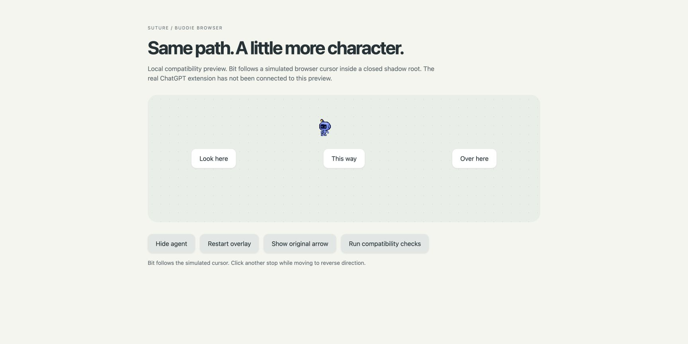
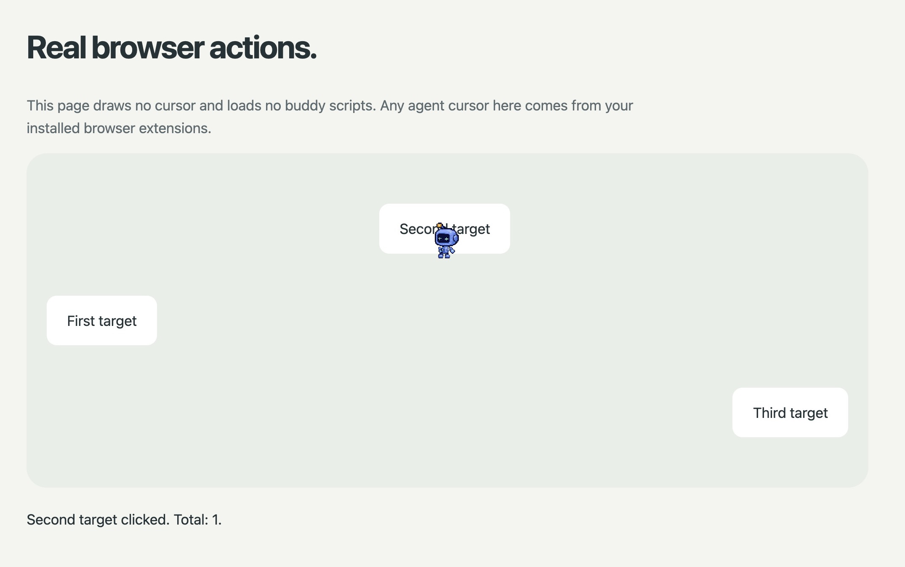

# Browser cursor investigation and companion prototype

The browser does have its own visible agent cursor. The earlier statement that
DOM browser actions never show one was too broad. The installed browser runtime
sends movement requests to the ChatGPT extension, which stores cursor state per
tab/session and draws an animated arrow inside the page. Native app control uses
a separate macOS window, which the existing Buddie renderer replaces.

This explains why a cursor can appear inside an ordinary tab. The inspected
implementation is independent of whether the tab was put into a group. This
investigation does not establish which model release changed tab organization.

## Inspected route

The installed `@oai/browser-desktop` service calls its UI adapter's `moveMouse`
before browser input dispatch. The ChatGPT extension publishes `AGENT_CURSOR_STATE`
to its content script, then waits for an arrival acknowledgement when requested.
The content script owns curved paths, springs, rotation, glow and visibility.

The cursor lives under `#codex-agent-overlay-root`, marked
`data-codex-agent-overlay-root="true"`, in a closed shadow root. The 24 × 24
`browser-agent-cursor` element carries the animated transform and opacity; a
23 × 24 image carries the gray artwork. The content script runs in top-level tabs.
These are inspected private markers, not an OpenAI customization API.

Chrome's documented
[`chrome.dom.openOrClosedShadowRoot`](https://developer.chrome.com/docs/extensions/reference/api/dom)
provides access to this drawing surface from an extension. No vendor file needs
to be modified. The companion uses that API and leaves the original cursor
controller and arrival messages running. It never calls private browser-input
APIs, sends actions or changes permission handling.

## Prototype review

| Before | After | Why |
| --- | --- | --- |
| The native renderer could not affect the browser's in-page arrow. | A separate content script discovers the known browser drawing surface. | Both control paths can retain their own input implementation. |
| Rotating the arrow asset would rotate the whole buddy. | Bit follows the translated anchor and opacity while remaining upright. | Turns and gait belong to the character; the target coordinate stays exact. |
| A second easing curve could lag behind the native cursor. | The adapter samples the existing transform without adding a positional spring. | Movement and arrival remain owned by the browser extension. |
| A failed replacement could hide the only cursor. | Artwork loads before hiding the arrow; unknown layouts, failure and teardown preserve or restore its visibility. | The stock renderer remains available. |

The 305-frame atlas comes from Bit's existing native renderer and approved
artwork. It includes five perspectives, walking/running, blinks and press/release
expressions. Pose changes follow observed distance/time. Reduced Motion suppresses
autonomous gait/blinks while retaining direct press feedback. Actual page input
is never intercepted; the canvas is pointer-transparent and accessibility-hidden.

**Initial prototype verdict: passed local compatibility; live integration was
pending at that stage.** Twelve fixture checks
passed in Brave through official CUA, including three fractional anchors under
rotation/stretch, hide/show, unknown artwork, image failure and restoration.
Motion checks passed at 30/60/120 Hz. The fixture explicitly uses a simulated
closed-root cursor and is not a test of cross-extension access or real arrival
timing. The live test below now verifies the installed replacement. Native walking is represented by pose frames rather than the full
continuous rig; landing quality, frame costs and live click attribution need
review after installation.

The companion currently uses default Bit. It does not yet synchronize Studio
settings or cover browser chrome, internal pages, embedded browser surfaces,
PDF viewers or non-Chromium providers. See [installation and scope](../browser-extension/README.md)
and [the initial fixture evidence](evidence/browser-companion.json).

## Live Brave verification

On October 1, 2026, the user approved installation and manually loaded the
companion into Brave. The computer-use browser policy blocked navigation to the
extension manager, so the agent did not install it through an alternate surface.
The companion source remained at commit `3cb4a27` throughout the following test.

Official CUA browser Playwright locator clicks exercised the real ChatGPT
extension on `preview/live.html`. This page contains only three buttons and a
click counter: no simulated cursor, imported adapter or buddy artwork.

| Check | Observed result |
| --- | --- |
| First, second and third targets | Counter advanced to 1, 2 and 3. Native screenshots at the second and third targets showed Bit and no gray arrow. |
| Return to the first target | Counter reached 4; Bit appeared at the left target with the click expression. |
| Reload, then click the second target | Counter reset and reached 1; Bit reattached without reloading either extension. |

This is a crop of an official CUA native Brave-window screenshot, preserving the
page heading, all targets and result counter while excluding browser chrome.
The initial browser-page screenshot omitted the cursor; native window captures
provided the visual evidence. No drawing was injected through evaluation, and
the inspected official extension and browser-service files retain their original
hashes. See [the live evidence record](evidence/browser-live.json).

**Verdict: pass the installed Brave replacement and page-reload integration.**
The captures establish visible replacement, successful input and reconnection.
They do not measure the whole travel animation, frame costs, exact hotspot error,
arrival-message latency or continuous motion quality. Disable/uninstall recovery,
other sites and browser versions remain unverified. The extension stays enabled
for ordinary browser-use sessions; refresh tabs opened before installation.
