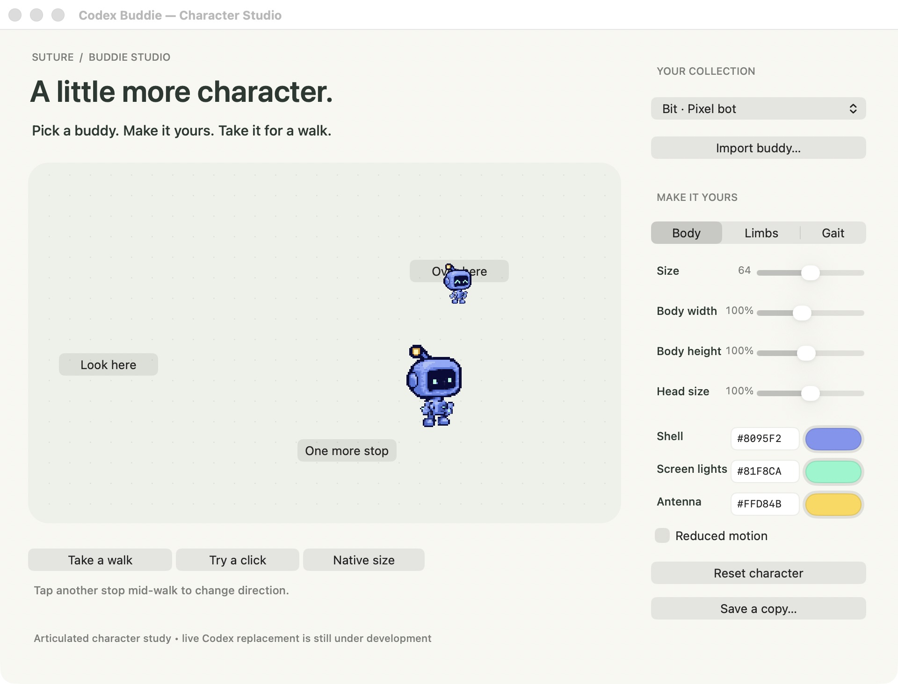

# Native cursor layout and live replacement

**Bit visibly replaced the native fog cursor during official CUA clicks in the
Lab.** The final screenshot used the production layout code with diagnostic
capture disabled. The small bot on “Over here” is the real replacement; the
larger bot below it is the Studio's separate demonstration.

The user explicitly allowed this Lab test session. The isolated MCP test client
forwarded that authorization through the official runtime's form elicitation,
limited to `ai.suture.codex-buddie.preview` and session persistence. No permanent
grant, installed vendor file, authentication check, MCP setting or OS security
setting was changed. All UI input used documented official CUA methods.

## What the live test found

| Before | After | Why |
| --- | --- | --- |
| The replacement detached a newly created SwiftUI host while its frame was zero. The native window stayed at 0 × 0 and no character could draw. | Resolve the original host's intrinsic and fitting sizes and finish its layout while attached, then substitute the character. | SwiftUI gets to establish the native dimensions before losing its window. No hardcoded production window size or offset is introduced. |
| Plain-view harness tests passed despite this failure. | A real `NSHostingView<CursorView>` starts with a zero frame and must produce a 126 × 126 drawable replacement with a center hotspot. | This exercises lazy SwiftUI layout rather than an already sized stand-in. |
| Renderer startup was the only live evidence. | Authorized app observation, three target clicks, a slider drag, size restoration and screenshots succeeded. The final screenshot also passed with capture disabled. | Input and actual visible native artwork are now exercised together. |

The original gray host remains retained for native geometry queries and detached
from the view hierarchy. The replacement keeps the native window's dimensions,
placement, alpha and input transparency. If geometry remains empty, it keeps the
original content so the ordering hook can retry. Unknown renderers remain intact.

## Motion verdict: incomplete

The sampled click calls moved directly between endpoint positions. The drag
produced a short gait response, but the trace did not establish a continuous
curved path. Native press/release events still do not drive the character's click
reaction. Neither can be inferred from successful input alone.

The real screenshot includes the small replacement character. Cursor exclusion
from observations therefore cannot be claimed for this tested path. Exact
hotspot error, all gray-artwork transitions, software-style rendering in a real
session, multiple displays, cancellation, CPU/battery use and clean-machine
installation remain open. This result passes visibility and the tested Lab
inputs, not the full product or motion quality bar.

## Reproduce and inspect

Run `bash scripts/build.sh`, then `bash scripts/test-native-layout.sh` and the
Lab's `--self-test`. The SwiftUI regression and all existing Cocoa renderer,
anatomy, motion, artwork and Studio persistence checks passed.

Use [the isolated development setup](development-signing.md) for real CUA input,
with an MCP client that honors normal app-access elicitation. Grant only the
apps intended for that test. Vendor runtime binaries remain local.

For optional diagnostics, set `BUDDIE_CAPTURE_DIRECTORY` to a new absolute
directory before launching the isolated service. Only Buddie's transparent
replacement view and its geometry are saved, in the research bundle only.
The writer caps output at 480 samples and 64 MiB of PNGs; moving poses sample at
up to 30 Hz and still poses at up to 1 Hz. Bitmap caching has overhead, so these
frames are debugging evidence, not a performance benchmark. Capture is off by
default. The final live screenshot here used that default.

[Source hashes, local evidence and exact limits](evidence/native-layout.json)
identify the failed capture, diagnostic discovery, first working layout run and
final build separately. Earlier evidence records are historical and unchanged.
