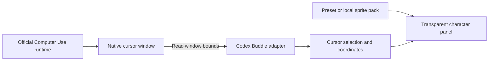

# Can the computer-use cursor become a character?

Research date: September 30, 2026, America/Los_Angeles.

## Finding

Yes: the character-rendering portion is straightforward, and an independent native-cursor follower is feasible on this Mac. The difficult part is getting accurate agent activity and replacing every place OpenAI displays the cursor.

The investigation found three distinct rendering surfaces. A useful product should state which it supports instead of claiming one global cursor skin changes all three.

| Surface | Evidence | What we can do |
| --- | --- | --- |
| Native macOS computer use | Dedicated helper process, cursor classes, image asset, and a separate cursor window observed moving during CUA actions | Read window bounds and draw an independent buddy near or over it; prototype implemented |
| Built-in browser | JavaScript creates an image element inside a pointer-events-disabled overlay, with motion, rotation and visibility state | A renderer integration could substitute a sprite renderer; no supported extension point verified |
| Background picture-in-picture / pet attachment | Native cursor-location callback and app-internal message transport | Needs correct mapping into the preview or an integration inside its renderer; not implemented |

## What was actually found

The installed ChatGPT app was version **26.928.21956**, build **12404**. The running Computer Use helper was **26.924.1001281**, bundle identifier **`com.openai.sky.CUAService`**. An app update and a persistent helper can be on different versions. See [the hashes and exact marker offsets](observed-runtime.json) for this particular installation. These are observations about installed software, not a stable public interface.

### Native cursor

Read-only inspection of the helper executable found `ComputerUseCursor`, its nested window/style classes, `SoftwareCursorStyle`, `FogCursorStyle`, cursor-motion callbacks, and the string `Computer Use Cursor`. Apple's asset inspection tool also listed a **`SoftwareCursor`** image in the helper's asset catalog.

A live window-metadata probe exposed windows titled **`Software Cursor`**, owned by **`ChatGPT Computer Use`**. On this machine their bounds were **126 × 126 points**. During a Calculator sidebar interaction through the official CUA tool, the tracked window appeared at `(828, 139)` and subsequently moved to `(908, 139)`; alpha samples showed its fade-in. The prototype later observed more position changes during coordinate clicks and its own preview's click test.

This proves that there is a separately observable visual cursor window. It does **not** prove that the center of that window is always the exact input hotspot. The current app uses the center as an approximate visual anchor. It never uses the estimated point to perform an input action.

Two independent cursor windows were present during the experiment. They can reflect concurrent sessions; the prototype selects the most recently moving one and hides after 12 seconds without movement. It cannot identify the originating chat. Pinning to a session/window and distinguishing stale cursors are required product work.

### Built-in browser cursor

The installed `cursor-chat-*.js` renderer accepts an `assetUrl`, creates an `img` marked with `browserAgentCursorAsset`, and renders it inside a non-interactive overlay. It maintains cursor position, visibility, move sequences, spring motion and rotation. The bundled image is distinct from the operating system's ordinary pointer.

That is a concrete substitution point in an application whose renderer we control: replace the static image with a sprite component while preserving its position, arrival timing and input hotspot. In OpenAI's installed app, this is private implementation detail. The prototype does not modify it.

### Cursor events already exist internally

The native bridge exports a function named `setRemoteHostedPIPContentComputerUseCursorLocationHandler`. The main process stores an active cursor point and forwards a renderer message named `avatar-overlay-computer-use-cursor-changed`, converting screen coordinates to local overlay coordinates. This establishes an internal path from cursor activity to a pet/preview renderer.

It is **not** evidence that an arbitrary third-party process can subscribe. The relevant public product documentation and exposed macOS CUA options inspected here did not reveal a cursor-skin or cursor-location subscription API. An internal callback cannot simply be imported into a separate process and assumed to receive another process's events.

OpenAI documents customizable [Pets](https://learn.chatgpt.com/docs/pets), including attachment of the macOS computer-use picture-in-picture window. That supports a neighboring companion experience, but the documented pet workflow does not establish replacement of the agent cursor.

## The practical implementation

The prototype is a small Swift/AppKit application with no third-party runtime dependencies:

1. Identify the Computer Use helper by its bundle ID and process IDs.
2. Poll visible window metadata using Apple's `CGWindowListCopyWindowInfo`.
3. Match only known cursor window titles from those helper processes.
4. Choose the recently moving cursor and convert Quartz coordinates into AppKit points.
5. Draw an original or imported character in a transparent, non-activating `NSPanel` with `ignoresMouseEvents = true`.
6. Switch between movement and idle animation using observed motion.

Apple documents [window-metadata enumeration](https://developer.apple.com/documentation/coregraphics/cgwindowlistcopywindowinfo(_:_:)) and [mouse-transparent windows](https://developer.apple.com/documentation/appkit/nswindow/ignoresmouseevents). Apple also describes how [window titles can require Screen Recording authorization](https://developer.apple.com/videos/play/wwdc2019/701/). A successful developer-machine run does not establish permission-free installation for other users.

The overlay moves in points rather than screenshot pixels. The conversion uses the primary display's coordinate origin; it does not multiply by Retina scaling. Negative coordinates are preserved for displays above or left of the primary display. Real multi-monitor layouts still need testing.

The implementation polls metadata at 15 Hz and draws at 30 Hz. Apple's documentation calls window enumeration relatively expensive. CPU usage, battery impact and perceived tracking latency must be measured before choosing production rates. A supported event subscription would be preferable if one becomes available.

### What the current overlay cannot claim

- It does not remove the original cursor. Cover mode places opaque character artwork over an approximate anchor, so edges, glow and rapid movements can reveal the original.
- It cannot replace an image inside another app's browser or picture-in-picture renderer.
- It does not know whether the agent is clicking, typing, thinking, blocked or done. Those require semantic events; position alone is insufficient.
- It does not promise exclusion from agent screenshots. `sharingType = .none` is not a universal ScreenCaptureKit guarantee. The observed preview screenshot retained the gray cursor and did not establish replacement in captured output.
- It has no tested support for lock-screen/background virtual display sessions, Spaces transitions, unusual display arrangements or different OpenAI releases.

## Routes to a complete product

| Route | Benefit | Main constraint | Recommendation |
| --- | --- | --- | --- |
| Independent macOS overlay | Works alongside the installed native runtime; easy to remove | Approximate tracking; previews remain separate; undocumented window names can change | Use for the first compatibility-labeled alpha |
| Adapter in an agent runner we control | Exact coordinates plus click/drag/type/idle lifecycle; clean screenshot exclusion | Actions must run through the integrated runner | Best long-term foundation for broad agent support |
| Official renderer/plugin integration | True replacement throughout supported surfaces | No public cursor customization hook verified | Seek upstream support; preserve an adapter interface |
| Patch installed app JavaScript/assets or inject native code | Could change the original renderer in a particular build | Code signing, app updates, private implementation and distribution burden | Research option; not used by this prototype |
| Existing ChatGPT pet installation | Established custom companion workflow | A pet is not documented as the agent's cursor | Optional complementary integration |

A runner adapter should emit small visual events such as `move`, `pointerDown`, `pointerUp`, `scroll`, `typing`, `idle`, `attention`, and `hidden`, with a session ID, coordinate space, window/display ID and timestamp. Only emit states supported by actual runtime events. Share the same character renderer across adapters.

For adapters we control, use a local Unix socket on macOS with per-user access and strict event validation. Keep visual failures independent of input execution. Preserve the official runtime's permission checks and session metadata; a generic MCP text-rewriting proxy is not enough to guarantee that. Never log typed text for animation.

## Presets, custom characters and generation

Character customization is an independent layer. This prototype already includes Mochi, Sprout and Orbit, drawn with original vector code, and a validated [PNG sprite-pack format](sprite-packs.md). It needs no model calls to run.

A generation workflow can produce a consistent character sheet, remove/verify the background, normalize every frame's scale and baseline, validate the grid, and write the manifest. Idle and movement are enough for the current adapter. Click, typing, drag, success and attention poses become useful when the event adapter actually supplies those states. Keep the interaction hotspot independent from character animation so a bouncing head never shifts a click.

Generated output should be a local data pack, not executable code. Preset packs can ship in the GitHub release, and community packs can use the same validator. Built-in generation, galleries, pack signing, preferences and one-click import are not implemented in this investigation.

## Distribution and platform scope

The repository now builds a small native `.app`, plus an optional installer into `~/Applications`. Production distribution should provide signed, notarized GitHub release downloads, with an uncomplicated permission explanation, an obvious quit control and a clear compatibility list. Source builds can remain available for contributors.

The initial target is macOS because this is where the actual gray-pointer implementation was inspected and tested. Windows computer use runs on the foreground desktop according to [OpenAI's documentation](https://learn.chatgpt.com/docs/computer-use), so an OS-pointer adapter is a plausible second target. Windows provides [GetCursorPos](https://learn.microsoft.com/en-us/windows/win32/api/winuser/nf-winuser-getcursorpos) and [layered windows with mouse-event transparency](https://learn.microsoft.com/en-us/windows/win32/winmsg/window-features) for those building blocks. It still needs implementation, tests and a reliable way to distinguish agent activity from a human moving the same cursor. Linux has not been evaluated here.

## Next build milestones

1. Validate the visible overlay on a clean Mac: permissions, real alignment, capture behavior, sleep/resume, full-screen apps and two displays. Pin an agent session and handle stale windows deterministically.
2. Improve the alpha experience: saved character choice, size/offset controls, pack import, consistent hiding, measured CPU/latency and signed distribution.
3. Build an event adapter for a controllable runner and prove exact click/drag/typing animation with the character excluded from model screenshots.
4. Investigate a supported upstream hook for the original native cursor and preview renderers. Only then describe that integration as full replacement.

No installed OpenAI files, app signatures, permissions, cursor settings or MCP configuration were changed during this investigation. All source written into this repository is original; the fingerprint tool records hashes and marker names without copying vendor implementation into the project.
